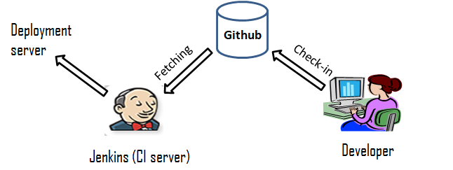
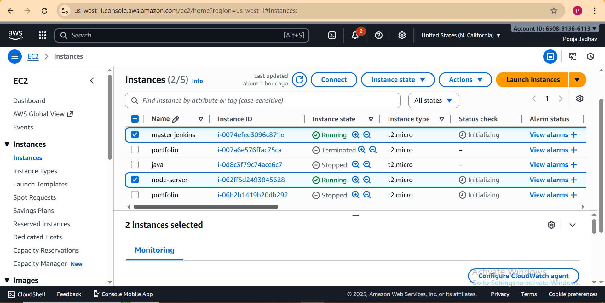
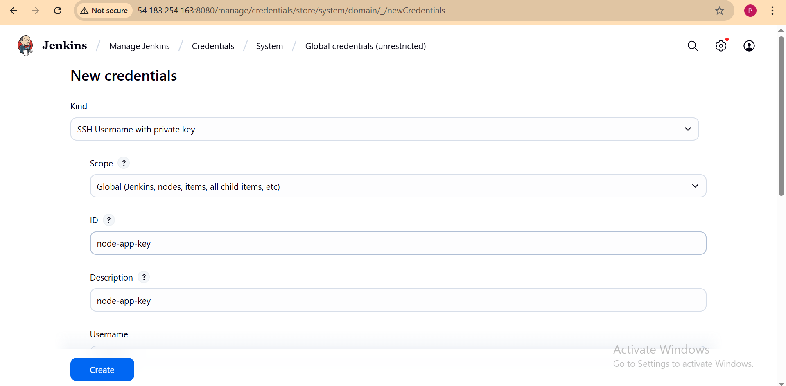
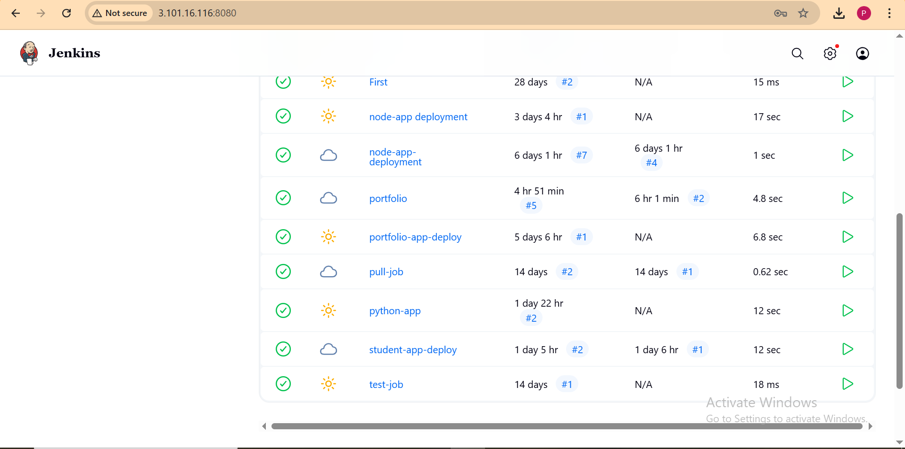
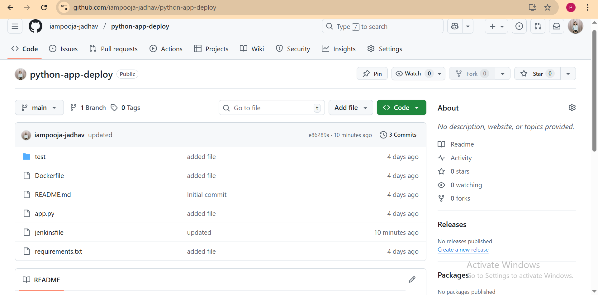
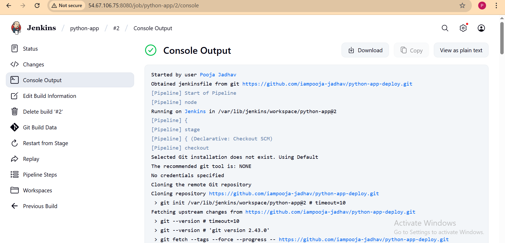
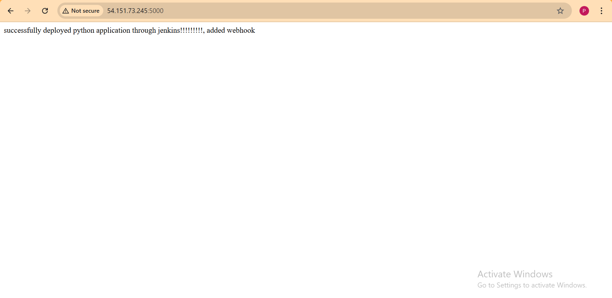

# Python Application - Fully Automated CI/CD Pipeline using Jenkins & AWS EC2

This project demonstrates a complete CI/CD pipeline setup for deploying a Python application automatically onto a deployment server using Jenkins, GitHub, and AWS EC2 Instances.

## Project Architecture
#### GitHub Repository → Jenkins Server (Build & Deploy) → EC2 Deployment Server (Run App using PM2)

#### EC2 Instance 1: Jenkins CI/CD Server
#### EC2 Instance 2: Application Deployment & Execution Server

## CI/CD Pipeline Architecture

### Prerequisites
### On Both EC2 Instances:

| Software | Purpose |  |
|-----------|-----------|-----------|
| Python3/pip | Run application | |
| Git  | Code cloning & management |  |
|Open SSH |SSH Communication|

### Extra on Jenkins Server:
| Software | Purpose |  |
|-----------|-----------|-----------|
| Jenkins | CI/CD automation | |
| Required plugging | Secure deployment |  |

### Extra on Deployment Server

| Software | Purpose |  |
|-----------|-----------|-----------|
| Pm2 | Run and monitor python application | |
| python3-venv | Create python virtual environment |  |

### Project Repository Structure
python-app-CICD/ │── app.py │── requirements.txt │── Dockerfile │── README.md │── Jenkinsfile └── test/

### Steps to Configure Deployment Server (EC2)
1. Launch a new EC2 Ubuntu instance.

2. Connect via SSH.

3. Install necessary tools: sudo apt update sudo apt install -y python3 python3-venv python3-pip npm git sudo npm install -g pm2

4. Create directory for app: mkdir -p /home/ubuntu/pythonapp

### Jenkins Pipeline Setup
1. Login to Jenkins Server.

2. Go to Manage Jenkins → Credentials → Add Credentials

      >Type: SSH Username with Private Key
      ID: node-app-key
      Username: ubuntu
      Private Key: (Paste PEM key)

      

 3.Create New Pipeline Job → pipeline script from SCM

    

4.Repository URL:https://github.com/iampooja-jadhav/python-app-deploy.git

5.Branch: main

6.Save and Build

## Jenkinsfile

## Push Code to GitHub

Create a new GitHub repository for your project.

Add all your project files including app.js and Jenkinsfile.

Commit and push the code to GitHub.

## Final Result

Automatic deployment on each Git push using Jenkins + PM2.

